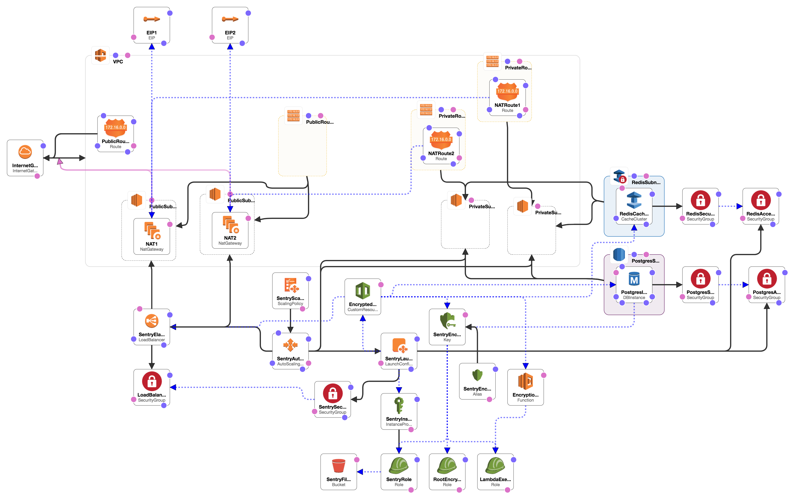

# What is it

An attempt to follow security best-practices to create a production-ready installation of Sentry.io on AWS.

Features:
- HTTPS end-to-end
- Load-balanced, Multi-AZ setup
- EC2 Auto-scaling group (also gives zero-downtime upgrades)
- Creates own VPC
- Encryption using integrated KMS key
- Limit sentry access to your GitHub organisation

## Getting Started

Just click [](https://console.aws.amazon.com/cloudformation/home#/stacks/new?stackName=sentry&templateURL=https:%2F%2Fs3-eu-west-1.amazonaws.com%2Fsentry-formation%2Fcloud-formation.yaml)

Or click ["Create Stack" in the CloudFormation AWS console](https://console.aws.amazon.com/cloudformation/home?#/stacks/new) and specify the Amazon S3 template URL:

```
https://s3-eu-west-1.amazonaws.com/sentry-formation/cloud-formation.yaml
```

### What you need to provide

- User accounts and secrets for Sentry, Redis and Postgres
- DNS name: the hostname you're going to use to access your sentry installation.
- SSL Certificate ARN: A certificate matching your DNS name that you've stored in KMS (see [Importing Certificates](http://docs.aws.amazon.com/acm/latest/userguide/import-certificate.html))
- SMTP email server for sending alerts (see [Using the Amazon SES SMTP Interface to Send Email](http://docs.aws.amazon.com/ses/latest/DeveloperGuide/send-email-smtp.html))
- GitHub App Id & API secret (if using GitHub to sign in).

### After first deployment

Once the load balancer has been created, you can update your DNS entry. See [Routing Traffic to an ELB Load Balancer](http://docs.aws.amazon.com/Route53/latest/DeveloperGuide/routing-to-elb-load-balancer.html) if using Route 53.

If you want to also encrypt your EC2 EBS volumes, you can make a copy of the original AMI, add encryption using the created `SentryEncryptionKey`. Then update your stack to the new encrypted AMI, which will provision new EC2 instances and remove the old instances.

### Automating Deployments

This is a great option if you want to automatically deploy your stack from your CI server:

1. Take a copy of `deploy-example.sh`.
2. Fill in the parameters.

### Running locally

```
vagrant up
ansible-playbook site.yml -u vagrant
```

Your site should then be available at https://33.33.33.20/

## Credits

Original version developed by Karl Turner (@otaiga), Bradley Allen (@ValkyrieUK) and Daniel Bradley (@danielrbradley).

[Using AWS KMS to Encrypt Values in CloudFormation Stacks](https://ben.fogbutter.com/2016/02/22/using-kms-to-encrypt-cloud-formation-values.html) by Ben Jones (@RealSalmon)

Starting point for CloudFormation setup: https://github.com/acervos/sentry

## CloudFormation Architecture Diagram


